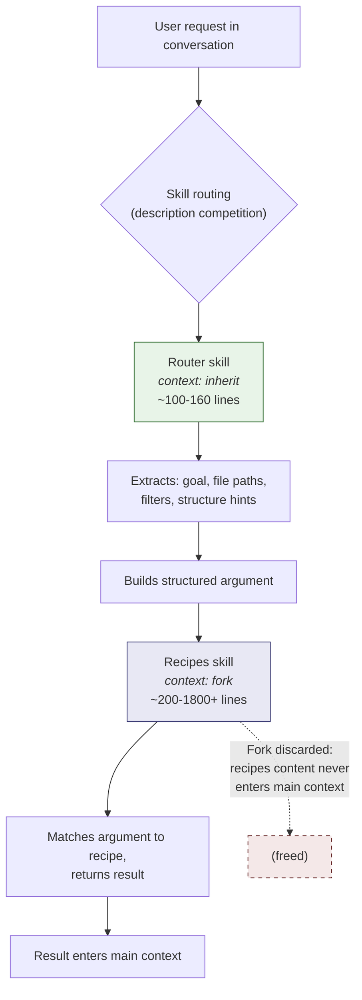

# Two-Tier Skill Pattern

A design pattern for LLM tool skills that separates context awareness from dense reference material using a router/recipes architecture with context isolation.

---

## The Problem

Context windows are finite. Dense reference material — command catalogs, API references, recipe collections, decision matrices — is valuable but bloats context. You want both conversation awareness and comprehensive references, but a single skill cannot be both lightweight and comprehensive without paying the full token cost of loading everything into the main context window.

The tension is structural. Thin skills that inherit the conversation can react to what the user actually said, but they carry no depth. Fat skills loaded with hundreds of recipes have depth, but every line of reference material occupies tokens in the main context whether or not it is relevant to the current query. A 1,500-line recipes file costs roughly 15,000 tokens just to be present.

The question: how do you give the LLM access to dense reference material without that material permanently occupying the context window?

## The Pattern

The solution is an `inherit` to `fork` boundary. Two skills work as a coordinated pair:

- **Router** (`context: inherit`): A thin skill that sees the full conversation. It extracts the user's goal, identifies relevant file paths and constraints from prior discussion, builds a structured argument string, and invokes the recipes skill.
- **Recipes** (`context: fork`): A dense reference store that runs in complete isolation. It receives the structured argument, matches it against its reference material, returns a result, and its entire content is discarded when execution completes. None of it enters the main context.

The router is the lens. The recipes store is the library. The lens focuses; the library never leaves the shelf.

| Property | Router | Recipes |
|----------|--------|---------|
| Context mode | `inherit` (sees conversation) | `fork` (isolated) |
| Typical size | 50-160 lines | 200-1800+ lines |
| Token cost to main context | Full (but small) | Zero |
| Contains | Context extraction logic, argument templates | Commands, recipes, decision matrices |
| Can invoke other skills | Yes (`allowed-tools: Skill`) | No (leaf node) |

## Flow



## Why It Works

### Token economics

The fork boundary means recipes content — which can be hundreds or thousands of lines — never enters the main context window. The router adds roughly 100-160 lines to context; the recipes store contributes zero. The savings scale with the density of the reference material.

Real numbers from the reference implementation:

| Skill pair | Router lines | Recipes lines | Recipes tokens (est.) | Savings vs. inline |
|------------|-------------|--------------|----------------------|-------------------|
| task-json | 161 | 774 | ~7,700 | 83% |
| task-debug | 146 | 1,829 | ~18,300 | 92% |
| task-network | 134 | 1,524 | ~15,200 | 92% |
| task-dev | 133 | 1,581 | ~15,800 | 92% |
| All 22 pairs | ~2,900 total | ~19,000 total | ~190,000 | 87% avg |

Token estimates use ~10 tokens/line for markdown with code blocks. The 87% average savings means that for every 100 tokens of skill infrastructure in the main context, roughly 670 tokens of reference material are available on demand but absent from the window.

### Routing competition

The router's description is deliberately richer and more specific than the recipes description. The recipes skill marks itself as "(internal)" and uses a minimal description. Combined with a single configuration rule ("prefer the more descriptive skill"), this ensures routing accuracy without complex dispatch logic. The LLM's existing ability to match user intent to natural-language descriptions does the work. No routing tables, no regex matching, no priority scores.

### Graceful degradation

The system handles misuse without failure. Direct recipes invocation works if the user provides explicit arguments — the fork simply processes them without conversation context. Vague router invocation triggers clarifying questions, because the router can see the conversation and recognize insufficient information. Trivial tasks bypass skills entirely; the LLM can always answer directly from its training data. No invocation path produces an error that the user cannot recover from.

## Quick Start

Generic router template:

```yaml
---
description: "Domain processing - verb1, verb2, verb3 data"
when_to_use: "Use when: scenario1, scenario2. Triggers: keyword1, keyword2, keyword3."
context: inherit
allowed-tools: Skill, Read
---

# Domain Task Router

You have access to the **full conversation context**. Build a well-formed argument for the recipes skill.

**User's request**: $ARGUMENTS

## Context Extraction

Analyze the conversation to identify:
1. **Goal** - What operation is needed?
2. **Target** - What data/file/system is involved?
3. **Constraints** - Filters, format requirements, scope limits
4. **Prior context** - Error messages, previous attempts, related discussion

## Invoke Recipes

Use the Skill tool to invoke `domain-recipes` with your constructed argument.
```

Generic recipes template:

```yaml
---
description: "Domain recipes reference (internal)"
context: fork
allowed-tools: Read
---

# Domain Recipes

**Task**: $ARGUMENTS

## Quick Reference

| Task | Command |
|------|---------|
| Common operation 1 | `command --flag` |
| Common operation 2 | `command --other-flag` |

## Category 1
[Dense reference material, commands, decision matrices...]

## Category 2
[More reference material...]
```

The router should fit in your head. The recipes store should fit in a book.

## Reference Implementation

This pattern was developed and validated with 22 skill pairs covering approximately 195 CLI tools. The pairs range from 774 to 1,829 lines on the recipes side. Adding a new domain is linear: write one router (~130 lines) and one recipes file (unbounded size, since it never touches the main context).

<details>
<summary>22 implemented skill pairs</summary>

| Domain | Router | Recipes | Recipes lines |
|--------|--------|---------|--------------|
| json | task-json | task-json-recipes | 774 |
| tabular | task-tabular | task-tabular-recipes | 806 |
| text-search | task-text-search | task-text-search-recipes | 879 |
| files | task-files | task-files-recipes | 834 |
| reverse-engineer | task-reverse-engineer | task-reverse-engineer-recipes | 827 |
| media | task-media | task-media-recipes | 1,038 |
| git | task-git | task-git-recipes | 850 |
| debug | task-debug | task-debug-recipes | 1,829 |
| network | task-network | task-network-recipes | 1,524 |
| containers | task-containers | (inline) | -- |
| http | task-http | task-http-recipes | 1,191 |
| database | task-database | task-database-recipes | 1,292 |
| process | task-process | task-process-recipes | 811 |
| system | task-system | task-system-recipes | 1,269 |
| dev | task-dev | task-dev-recipes | 1,581 |
| api-test | task-api-test | task-api-test-recipes | 1,091 |
| crypto | task-crypto | task-crypto-recipes | 724 |
| logs | task-logs | task-logs-recipes | 685 |
| backup | task-backup | task-backup-recipes | 748 |
| archives | task-archives | task-archives-recipes | 92 |
| permissions | task-permissions | task-permissions-recipes | 87 |
| watch | task-watch | task-watch-recipes | 160 |

</details>

## Intent-Based Routing

Descriptions indexed by user symptoms route better than descriptions indexed by tool names.

```yaml
# Generation 1: tool-indexed (weaker routing)
description: "strace, perf, valgrind, gdb profiling and debugging"

# Generation 2: symptom-indexed (stronger routing)
description: "Debugging and profiling - program crashes randomly, CPU at 100%,
  takes forever to run, eating all my RAM, why is it slow, memory leak, segfault"
```

Lead with the problem the user has, not the tool you will use. Users say "my program is slow," not "I need strace." Symptom-indexed descriptions match the user's vocabulary, which is what the routing mechanism operates on. The LLM selects skills by comparing the user's message against each skill's description. When descriptions mirror how users phrase their problems, routing accuracy improves without any changes to the selection mechanism itself.

This is the single highest-leverage improvement available when writing skill descriptions. Tool names are implementation details. User symptoms are the query language.

## Limitations and Trade-offs

1. **Added latency.** Two skill invocations instead of one. The router adds a round-trip before the recipes skill executes. For simple queries where the user provides all necessary context upfront, this overhead is noticeable.

2. **Non-deterministic routing.** The LLM exercises judgment when selecting skills. The same query may occasionally route differently across sessions. Configuration guidance and strong descriptions reduce but do not eliminate variance.

3. **Overlapping domains require disambiguation.** "Search for text in log files" could route to text-search, logs, or files. Disambiguation tables in configuration resolve common overlaps, but edge cases persist. This is inherent to any system where domain boundaries are fuzzy.

4. **Source code availability short-circuits routing.** When the user's question can be answered by reading available source code, the LLM may bypass skills entirely. This is correct behavior, not a bug, but it means skill usage is not guaranteed even when a relevant skill exists.

5. **Not a retrieval system.** The router reads conversation context linearly. It does not perform semantic search or have access to external memory. Context extraction quality depends on how recently and clearly the relevant information appeared in conversation. Information from hundreds of messages ago may not be reliably extracted.
