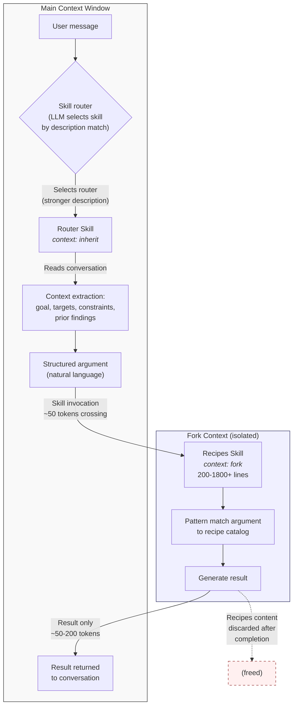

# Two-Tier Skill Pattern Specification

**Version**: 1.0
**Status**: Stable
**Date**: 2026-02-08

---

## 1. Abstract

The Two-Tier Skill Pattern separates context-aware routing from dense reference material in LLM tool skill systems. It solves the tension between needing conversation awareness (which requires `context: inherit`) and storing comprehensive reference material (which bloats the main context window). The key mechanism is a `context: fork` boundary that isolates reference content while preserving argument flow.

---

## 2. Motivation

### 2.1 Context window as scarce resource

LLM context windows are finite and shared across system prompts, conversation history, tool results, and skill content. Every token consumed by reference material is a token unavailable for reasoning, user context, or tool output. In systems with many skills, the aggregate reference material can easily exceed the useful context budget. A system with 20 skills, each containing 800 lines of reference material, would consume approximately 160,000 tokens before a single user message is processed.

The problem is structural. Reference material must be comprehensive to prevent hallucination. Context windows must remain available for the actual task. These requirements are in direct opposition when skills are loaded into a shared context.

### 2.2 The awareness-density tension

Skills that use `context: inherit` see the full conversation but their content persists in the main context window. Skills that use `context: fork` run in isolation -- their content is discarded after execution -- but they cannot see prior conversation. A skill that needs both awareness and density (e.g., a 1,500-line command reference that must also know which file the user discussed three messages ago) cannot satisfy both requirements in a single tier.

This is a fundamental constraint of the context model: visibility and persistence are coupled. A skill that sees the conversation necessarily occupies the conversation's context space. The Two-Tier Pattern decouples these by splitting the skill into two components, each optimized for one side of the tension.

### 2.3 Failure modes without the pattern

Without separation, systems exhibit three predictable failure modes:

- **Hallucinated flags**: The LLM fabricates plausible but incorrect command flags when reference material is absent. A flag like `--recursive-merge` may look reasonable but does not exist. A comprehensive recipes store prevents this by providing the actual flag inventory for each tool.

- **Reinvented wheels**: Without dense references, the LLM generates multi-step workarounds for tasks that have single-command solutions. A five-line shell pipeline replaces what should be a single invocation with the correct flags. The recipes store surfaces the canonical approach.

- **Context bloat**: Loading 1,500+ lines of reference into the main context window reduces capacity for conversation history, tool output, and reasoning. Multiple such skills compound the problem. When context is exhausted, the model loses access to early conversation messages, degrading its ability to maintain coherence across a session.

---

## 3. Architecture Overview



The main context window contains the user message, the lightweight router, and the final result. The fork context contains the dense recipes skill. The fork boundary ensures that only the argument (~50 tokens) and result (~50-200 tokens) cross between contexts. Recipes content is freed after execution.

---

## 4. Component Specification

### 4.1 Router Skill

**Frontmatter fields:**

| Field | Required | Value | Purpose |
|-------|----------|-------|---------|
| `description` | Yes | Rich, action-oriented, 10-20 words | Win routing competition |
| `when_to_use` | Yes | Scenarios + trigger keywords | Match user vocabulary |
| `context` | Yes | `inherit` | Access conversation history |
| `allowed-tools` | Yes | Must include `Skill` | Enable chaining to recipes |
| `argument-hint` | Recommended | Brief placeholder | Guide user input |
| `model` | Optional | `inherit` or specific model | Control model selection |

**Body template specification:**

The router body MUST contain these five sections:

1. **Context extraction instructions**: Enumerate what to extract from conversation history -- goal (what the user wants to accomplish), target (file paths, URLs, hostnames, PIDs, process names), structure hints (nested keys, column names, data formats), filter conditions (where clauses, thresholds, patterns), output format (table, CSV, JSON, plain text), scope limits (directories, date ranges, user accounts), and error context from prior tool results or failed attempts.

2. **Goal-to-tool mapping**: A table mapping user intents to the appropriate tool or recipe category within the domain. This enables the router to include tool preference hints in the constructed argument, improving recipe matching accuracy. For example, a file operations router might map "find duplicates" to `fdupes/jdupes`, "bulk rename" to `rename/mmv`, and "directory comparison" to `diff/meld`.

3. **Argument format**: A template showing how to construct the structured argument string. Include 2-3 concrete examples demonstrating different argument patterns. The template should make the argument self-contained -- a reader unfamiliar with the conversation should understand the request from the argument alone.

4. **Invocation instruction**: An explicit instruction to use the Skill tool to invoke the recipes skill with the constructed argument. This must name the recipes skill exactly as it appears in the skill registry. The instruction should specify that the router's task is complete once it issues the invocation -- it does not post-process the result.

5. **Fallback behavior**: Criteria for when to ask the user for clarification versus when to use the Read tool to gather more information autonomously. The router should ask when the goal is ambiguous (multiple valid interpretations). It should use Read when the target exists but details are needed (e.g., reading a file's first few lines to determine its structure).

**Sizing constraints:** 50-160 lines. The router must be lightweight enough that its full content in the main context window is a rounding error compared to conversation history. A 100-line router at ~10 tokens per line consumes ~1,000 tokens -- negligible in a 200,000-token context window.

### 4.2 Recipes Skill

**Frontmatter fields:**

| Field | Required | Value | Purpose |
|-------|----------|-------|---------|
| `description` | Yes | Minimal, includes "(internal)" | Lose routing competition |
| `when_to_use` | Yes | Describes expected input format | Not user-facing triggers |
| `context` | Yes | `fork` | Isolate from main context |
| `allowed-tools` | Yes | `Read` only | Leaf node, no chaining |
| `model` | Optional | `inherit` or specific model | Control model selection |

**Body template specification:**

1. **Title and tools list**: Name of the domain and enumeration of all CLI tools, APIs, or utilities covered. This serves as a quick inventory for the LLM to assess coverage.

2. **$ARGUMENTS injection point**: The line `**Task**: $ARGUMENTS` placed near the top of the body. This is where the platform injects the router's constructed argument. The recipes skill interprets this as its primary instruction.

3. **Quick reference table**: Common operations as a scannable table mapping task descriptions to commands. This handles the 80% case -- frequent operations that should be answered in seconds, not minutes.

4. **Decision matrix**: A "when to use what" table comparing available tools by strengths, limitations, and ideal use cases. When multiple tools can accomplish the same task, this matrix provides the selection criteria.

5. **Categorized recipes**: Organized by task type (not by tool). Each recipe includes a copy-paste-ready command with placeholder values clearly marked. Grouping by task ensures the LLM finds the relevant recipe by matching the user's goal, not by knowing which tool to look for.

6. **Common patterns / workflows**: Multi-step procedures for scenarios that require sequential commands. Each step includes the command and a brief explanation of what it produces for the next step.

7. **Edge cases**: The 20% of situations that cause 80% of problems. Platform-specific differences, character encoding issues, permission requirements, version incompatibilities, and other failure modes that are not obvious from tool documentation.

8. **Installation**: Package installation commands for all covered tools across common package managers. This ensures the recipes are self-contained -- a user encountering a missing tool can install it without leaving the skill context.

**Density guidelines:** No prose filler. Commands are self-documenting. Use tables over paragraphs. Every line should convey actionable information. A well-constructed recipes file reads like a reference card, not a tutorial.

**Sizing:** 200+ lines minimum. No upper bound. The fork boundary means size has zero impact on main context token cost. A 2,000-line recipes file costs exactly the same as a 200-line recipes file to the main context: zero tokens.

### 4.3 CLAUDE.md Routing Guidance

The minimal viable routing guidance is a single rule:

```
When invoking skills, prefer the more descriptive skill over internal/recipes variants.
```

Why this is sufficient: "More descriptive" is unambiguous -- the router always has a richer description than the recipes skill. The model understands the reasoning without needing to enumerate every pair.

Optional additions for disambiguation (only needed when domains overlap):

- A disambiguation table mapping request patterns to the correct skill when two domains could plausibly match (e.g., "search for text in files" vs. "find files by name").
- A brief explanation of the two-tier pattern for model context, establishing why two skills exist for each domain.

These additions are recommended when a system contains more than 10 skill pairs or when domains share vocabulary (e.g., "search" applies to text search, file search, log search, and database queries).

---

## 5. Context Behavior Specification

**`context: inherit` semantics**: The skill's content is loaded into the main context window. It sees the full conversation history: all prior user messages, assistant responses, tool calls, and tool results. Its content persists in context after execution. Token cost is the full content size, paid once, remaining for the conversation duration.

**`context: fork` semantics**: A new, isolated context is created. The skill sees only its own content and the arguments passed to it. It cannot see conversation history, other tool results, or prior messages. After the skill completes, its entire context -- including all reference content -- is discarded. Only the result is returned to the main context.

**Token economics model:**

| Component | Inherit cost | Fork cost |
|-----------|-------------|-----------|
| Skill content (body) | Full (~10 tokens/line) | Zero to main context |
| Argument (inbound) | N/A | ~50 tokens |
| Result (outbound) | In main context | ~50-200 tokens |
| Conversation history | Already present | Not available |
| Net main context impact | Content size | Argument + result only |

The fork boundary is a one-way valve. Arguments flow in. Results flow out. Everything else is discarded.

For a concrete example: a recipes skill with 1,500 lines of reference material at ~10 tokens per line contains ~15,000 tokens of content. Under `context: inherit`, this consumes 15,000 tokens of the main context window. Under `context: fork` with the Two-Tier Pattern, the main context cost is ~50 tokens (argument) + ~100 tokens (result) = ~150 tokens. The savings ratio is 100:1.

---

## 6. Routing Mechanism

### Description competition

When an LLM system presents multiple skills, the model selects based on description relevance to the user's request. This is the primary routing mechanism -- no explicit dispatch logic, router tables, or classifier models. The description is the routing function.

Description quality directly determines routing accuracy. A skill with a vague description will lose to any skill with a more specific description, regardless of correctness. Description writing is a first-class engineering concern.

### Intent-based vs. tool-based indexing

Early skill descriptions listed tool names. This works when users know which tool they need but fails when users describe symptoms or goals. Users describe problems, not tools:

```yaml
# Generation 1: tool-indexed
description: "strace, perf, valgrind, gdb profiling and debugging"
when_to_use: "Use for system call tracing, CPU profiling, memory leak detection"

# Generation 2: symptom-indexed
description: "Debugging and profiling - program crashes randomly, CPU at 100%,
  takes forever to run, eating all my RAM, why is it slow, memory leak, segfault"
when_to_use: "Use when: program crashes randomly, CPU usage at 100%, program takes
  forever to run, application eating all RAM. Triggers: crashes, slow, memory leak,
  segfault, why is it slow, eating RAM, CPU 100%"
```

Symptom-indexed descriptions match the user's natural vocabulary. "My program is eating all my RAM" matches a description containing that phrase. "Memory profiling with valgrind" requires the user to already know the solution.

### The "(internal)" convention

Recipes skills include "(internal)" in their description. This serves as two-factor suppression:

1. The word "internal" signals to the model that the skill is not user-facing. Models consistently interpret "internal" as "not intended for direct invocation" across different phrasing and contexts.

2. Combined with the CLAUDE.md "prefer more descriptive" rule, it creates a strong routing preference for the router. Even if the recipes description partially matches a query, the router's richer description and the absence of "(internal)" make it the preferred choice.

Neither mechanism alone is fully reliable; together they provide robust suppression in all observed cases.

---

## 7. Argument Protocol

### Why natural language, not JSON

The recipes skill is itself an LLM -- it interprets arguments semantically, not syntactically. Natural language arguments are more flexible, tolerate imprecision, and do not require schema validation. The router can include contextual notes ("this file was discussed earlier and has nested arrays") that would be awkward in a structured format.

JSON arguments would require a schema, validation logic, and error handling for malformed input. Natural language delegates interpretation to the LLM. The cost is some ambiguity; the benefit is zero parsing failures and rich contextual transfer.

### Three argument patterns

**File-centric** (skills operating on files: JSON, tabular, text, archives, media):

```
<goal> from <file_path> - structure: <hints>, filter: <conditions>, output: <format>
```

| Component | Required | Example |
|-----------|----------|---------|
| goal | Yes | "extract email addresses" |
| file_path | Yes | "/tmp/data.json" |
| structure | Situational | "nested in .users[].contact.email" |
| filter | Situational | "where .status == 'active'" |
| output | Situational | "as CSV with headers" |

**Target-centric** (skills operating on targets: network, HTTP, API testing):

```
<goal> on <target> - options: <flags>, output: <format>
```

| Component | Required | Example |
|-----------|----------|---------|
| goal | Yes | "scan open ports" |
| target | Yes | "192.168.1.0/24" |
| options | Situational | "top 1000 ports, service detection" |
| output | Situational | "greppable format" |

**Action-centric** (skills performing system actions: process, permissions, system):

```
<action> [target] - scope: <what>, options: <how>
```

| Component | Required | Example |
|-----------|----------|---------|
| action | Yes | "kill all processes" |
| target | Situational | "matching 'node'" |
| scope | Situational | "current user only" |
| options | Situational | "graceful (SIGTERM first)" |

These patterns are guidelines, not schemas. The router constructs arguments that are readable and unambiguous. The recipes skill interprets them. Variations in phrasing or structure are acceptable as long as the intent is clear.

---

## 8. Anti-Patterns

| Anti-pattern | Problem | Correct approach |
|-------------|---------|-----------------|
| Routing logic in recipes | "STOP - use task-X instead" confuses the skill when correctly invoked via the chain | Recipes should process any well-formed argument without routing guards |
| Dense recipes in router | 500+ lines in `context: inherit` defeats the token efficiency that motivates the pattern | Move all reference material to the recipes skill |
| Weak router description | "JSON router" loses the routing competition to any skill with a richer description | Use rich, action-oriented descriptions with trigger keywords matching user vocabulary |
| Strong recipe triggers | Recipes with user-facing triggers in `when_to_use` compete with the router for selection | Recipes description should be minimal with "(internal)" and describe expected input format |
| Router without Skill tool | `allowed-tools: Read` prevents the router from chaining to the recipes skill | Router must include `Skill` in allowed-tools |
| Recipes with Skill tool | Recipes invoking other skills creates uncontrolled invocation chains and circular dependencies | Recipes are leaf nodes -- `allowed-tools: Read` only |
| Argument passthrough | Router passes `$ARGUMENTS` directly to recipes without context enrichment | Router must extract context from conversation and build structured arguments |
| Conversational recipes | Prose explanations in the recipes file waste token budget without adding actionable content | Commands are self-documenting; use tables over paragraphs; every line must convey information |

---

## 9. Implementation Checklist

### CLAUDE.md

- [ ] Contains "prefer more descriptive skill" routing guidance
- [ ] Includes disambiguation table for overlapping domains (if applicable)

### Router Skill

- [ ] Filename follows `task-{domain}.md` convention
- [ ] `description`: rich, action-oriented, 10-20 words
- [ ] `when_to_use`: scenarios + 6-10 trigger keywords
- [ ] `context: inherit`
- [ ] `allowed-tools` includes `Skill`
- [ ] Body: context extraction instructions
- [ ] Body: goal-to-tool mapping table
- [ ] Body: argument format with examples
- [ ] Body: invocation instruction for recipes skill
- [ ] Body: fallback behavior (when to ask, when to Read)
- [ ] Size: 50-160 lines

### Recipes Skill

- [ ] Filename follows `task-{domain}-recipes.md` convention
- [ ] `description`: minimal with "(internal)"
- [ ] `when_to_use`: describes expected input, not user triggers
- [ ] `context: fork`
- [ ] `allowed-tools: Read`
- [ ] Body: `$ARGUMENTS` injection point
- [ ] Body: quick reference table
- [ ] Body: categorized recipes (by task, not by tool)
- [ ] Body: common patterns / multi-step workflows
- [ ] Body: edge cases
- [ ] Body: installation instructions
- [ ] Size: 200+ lines

### Verification

- [ ] Vague query routes to router, not recipes
- [ ] Router extracts file paths and context from conversation
- [ ] Full chain: router -> recipes -> result
- [ ] Direct recipes invocation works with explicit arguments
- [ ] Token cost measured: recipes content does not appear in main context

---

## 10. Verification Procedure

### Test 1: Routing accuracy

Issue a vague, symptom-based query (e.g., "help me with that JSON file"). Verify the router skill is selected, not the recipes skill. Repeat with 5 different phrasings of increasing ambiguity. All phrasings should route to the router. If any phrasing routes to the recipes skill, the router's description or the recipes' "(internal)" suppression requires adjustment.

### Test 2: Context extraction

Mention a file path early in conversation (e.g., "I have a file at /tmp/users.json with nested user records"). Continue the conversation for several messages on unrelated topics. Then ask a skill-related question without repeating the path (e.g., "extract all the email addresses from that file"). Verify the router extracts the correct file path from conversation history and includes it in the constructed argument.

### Test 3: Full chain

Issue a complete request that requires context extraction, argument construction, and recipe matching. Verify four properties: (a) the router skill is selected by the routing mechanism, (b) the argument constructed by the router includes all relevant context extracted from the conversation, (c) the recipes skill returns an actionable result that correctly addresses the request, and (d) the result appears in the main conversation and can be referenced in subsequent messages.

### Test 4: Direct recipes invocation (graceful degradation)

Invoke the recipes skill directly with an explicit, well-formed argument (e.g., "extract .users[].email from /tmp/data.json as CSV"). Verify it returns a useful result without requiring conversation context. This confirms the system degrades gracefully when the router is bypassed. The recipes skill must not depend on the router -- it must function independently when given a complete argument.

### Test 5: Token cost measurement

Execute a skill chain and examine the context window state afterward. Verify that the recipes skill's content (which may be 500-1,800+ lines) does not appear in the main context. Only the argument (~50 tokens) and result (~50-200 tokens) should be present. This can be verified by examining the token count before and after the skill chain execution -- the delta should correspond to argument + result size, not recipes content size.
